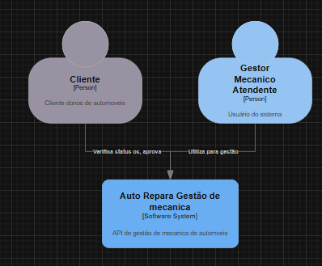
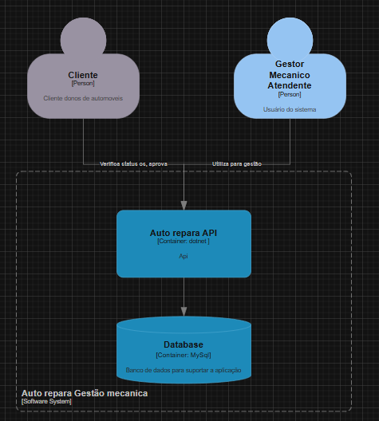
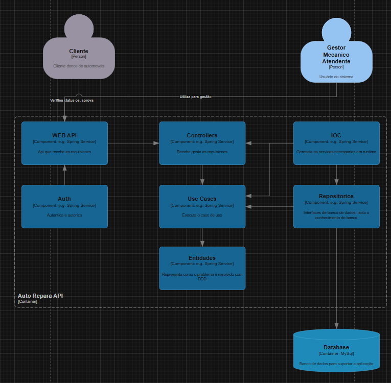
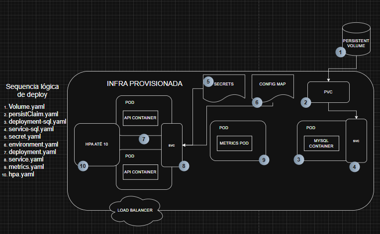

# 🚗 Sistema Integrado de Atendimento e Execução de Serviços – Oficina Mecânica

## 📌 Objetivo
Este projeto é o MVP do back-end de um sistema para gestão de ordens de serviço, clientes, veículos e peças de uma oficina mecânica.  
Seguindo a proposta da fase 2 foi implementado em cima da arquitetura em camadas a clean architecture para deixara ainda mais robusto e resiliente a aplicação, alem de adicionar alguns endpoints e também ter melhorias como: ci/cd, terraform, k8s com auto scale etc

---

## ⚙️ Funcionalidades
- Criação e acompanhamento de **Ordens de Serviço (OS)** com status automatizados:
  - Recebida, Em diagnóstico, Aguardando aprovação,aprovada, Em execução, Finalizada, Entregue.
- Cadastro e gestão de **clientes, veículos, serviços e peças**.
- Controle de **estoque de peças e insumos**.
- Geração automática de **orçamentos** e envio para aprovação do cliente.
- Autenticação via **JWT** para APIs administrativas.
- APIs RESTful documentadas com **Swagger**.

---

## 🛠️ Tecnologias Utilizadas
- **Linguagem:** C#  
- **Framework:** dotnet core  
- **Banco de Dados:** MySQL 8.0  
- **Containerização:** Docker + Docker Compose  
- **Testes:** Unitários e de integração com cobertura mínima de 80%

---

## 📂 Estrutura do Projeto - Mantive a estrutura base(as pastas) mas dentro de cada estrutura estruturei a clean architecture ex: dentro de application temos os usecases, dentro de domain temos as entidades e assim sucessivamente.
.github
k8s/*yamls
infra/*terraform
src/Application
src/AutoReparaAPI
src/Domain
src/Infra
src/IOC
src/Tests
src/Dockerfile
src/docker-compose.yml
src/GestaoAutoRepara.slnx
README.md


## 🏗️ Arquitetura Proposta




---

## 🚀 Como Executar Localmente
1. Clone o repositório:
   ```bash
   git clone https://github.com/Maquese/techchallengeone
   ```
2. Acesse a pasta:
   ```bash
   cd techchallengeone/app
   ```
3. Suba os containers:
   ```bash
   docker compose up --build -d
   ```
4. Acesse a API:
   ```text
   http://localhost:5000
   ```
5. Acesse a documentação Swagger:
   ```text
   http://localhost:5000/swagger
   ```
6. Para derrubar o ambiente:
   ```bash
   docker compose down
   ```

## 🔁 CI/CD local
O repositório já conta com um workflow em `.github/workflows/ci-cd-local.yml` que executa:
- build da solução .NET
- execução dos testes
- build da imagem Docker
- subida do stack local com Docker Compose

Para executar manualmente no GitHub Actions, use a opção "Run workflow" no painel do repositório.

---

---

## 🏗️ Arquitetura Proposta
### Componentes da aplicação
- `AutoReparaAPI`: serviço ASP.NET Core que expõe APIs REST para clientes, ordens de serviço, veículos e estoque.
- `Aplication`, `Domain`, `Infra`, `IOC`: camadas da aplicação que suportam lógica de negócio, entidades, repositórios e injeção de dependências.
- MySQL: banco relacional para persistência dos dados.

### Infraestrutura provisionada
- Kubernetes local (cluster existente via `kubectl`): executa os deployments da API e do MySQL.
- `Deployment` da API e `Deployment` do MySQL.
- `Service` da API (`LoadBalancer` local) e `Service` do MySQL (`NodePort`).
- `ConfigMap` para configurações públicas de ambiente.
- `Secret` para dados sensíveis (senha do MySQL, string de conexão e JWT secret).
- `PersistentVolume` e `PersistentVolumeClaim` para armazenamento persistente do MySQL.
- `metrics-server` para métricas de cluster e HPA.
- `HorizontalPodAutoscaler` para escalar o deployment da API com base em CPU.

### Fluxo de deploy
1. Construir a imagem Docker da API com o `Dockerfile`.
2. Para desenvolvimento local, usar `docker-compose` para garantir API + MySQL.
3. Para deploy Kubernetes local, usar Terraform para aplicar os manifestos em `kub/`.
4. O `Secret` é aplicado antes do deployment da API para injetar valores sensíveis.
5. O HPA monitora uso de CPU e escala réplicas do deployment da API.

---

## ☸️ Deploy em Kubernetes
### Pré-requisitos
- Cluster Kubernetes local disponível (`minikube`, `kind`, Docker Desktop Kubernetes, etc.).
- `kubectl` configurado para o cluster.
- `terraform` instalado.

### Passos
1. Navegue até o diretório Terraform:
   ```bash
   cd terraform
   ```
2. Inicialize o Terraform:
   ```bash
   terraform init
   ```
3. Aplique a infraestrutura:
   ```bash
   terraform apply
   ```
4. O processo aplica os manifestos em `kub/` na ordem:
   - `volume.yaml`
   - `persistClaim.yaml`
   - `deployment-sql.yaml`
   - `service-sql.yaml`
   - `secret.yaml`
   - `environment.yaml`
   - `deployment.yaml`
   - `service.yaml`
   - `metrics.yaml`
   - `hpa.yaml`

### Resultado esperado
- MySQL em execução no cluster
- API ASP.NET Core acessível via Service
- Dados persistidos em volume
- HPA pronto para escalar com base em CPU

---

## ⚙️ Provisionamento da infraestrutura com Terraform
O Terraform atual não cria o cluster Kubernetes nem um banco de dados em nuvem; ele executa `kubectl apply` nos manifestos locais.
Use-o para aplicar a infraestrutura Kubernetes local já modelada nos arquivos YAML.

---

## 🔐 Uso de Secrets
No arquivo `kub/secret.yaml` devem ficar os valores sensíveis:
- `MYSQL_ROOT_PASSWORD`
- `ConnectionStrings__DefaultConnection`
- `Jwt__SecretKey`

Esses valores não devem ser armazenados no `ConfigMap`.

---
 
## 📄 Collection de APIs
- Swagger: `http://localhost:5000/swagger`
- Postman Collection:  
- Collection completa:  

---

## 🧪 Testes
```bash
dotnet test
```

---

## 🔒 Segurança
Autenticação JWT para rotas administrativas.
Validação de dados sensíveis (CPF, CNPJ, placa de veículo).

---


## 👥 Equipe
Kenney Maquese
Discord: Kenney - rm374177

---

## 📎 Links
📘 Documentação DDD : https://drive.google.com/file/d/1SiuB8-Hso8AXvtbeRIW2V1-Y8_mfmyWc/view?usp=sharing
📘 Toda a documentação: https://drive.google.com/drive/folders/17s-o27T-Lx22VP-ce8oVhZQR15ROc96a?usp=sharing

---

## Considerações 
Tive vários pontos que gostaria de fazer melhor mas me segurei devido a ser um MVP, segurança, estoque, cliente e outras coisas que devem 
ser melhoradas na continuidade do projeto.
Me debrucei muito mais no processo de entendimento do DDD que é o que de fato eu não tinha muito conhecimento e o que eu queria me aprofundar. 
Não manjo muito de OWASPZAP então pode não ter ficado tão bom quanto deveria, o meu processo foi chamar as api via insominia com proxy e depois atacar.
