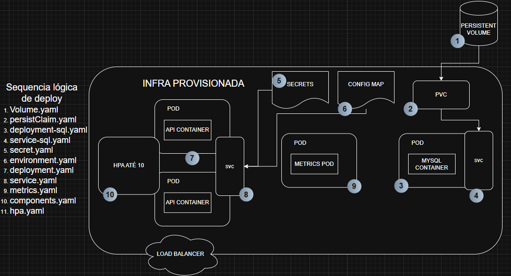

# 🚗 Sistema Integrado de Atendimento e Execução de Serviços – Oficina Mecânica

## 📌 Objetivo desta fase
Esta fase entrega a evolução do MVP para um backend preparado para produção e orquestração em Kubernetes. O foco foi:
- estruturar a solução em Clean Architecture;
- documentar as APIs com OpenAPI/Swagger;
- habilitar execução local com Docker Compose;
- provisionar infraestrutura Kubernetes local via Terraform;
- adicionar deploy em Kubernetes com persistência e autoscaling;
- garantir testes automatizados e CI/CD básico.

---

## 🧩 Descrição da solução
O sistema gerencia ordens de serviço, clientes, veículos, serviços e controle de estoque para uma oficina mecânica. A API oferece endpoints REST para:
- cadastro de clientes, veículos, serviços e peças;
- cadastro e acompanhamento de ordens de serviço;
- controle de estoque e orçamentos;
- autenticação JWT para rotas administrativas;
- documentação e testes automatizados.

---

## 🏗️ Arquitetura Proposta





## 🏗️ Arquitetura proposta
A solução segue uma arquitetura em Clean Architecture mantendo as dlls inicias do DDD:
- `AutoReparaAPI`: API ASP.NET Core que expõe os endpoints.
- `Application`: regras de orquestração e casos de uso.
- `Domain`: entidades, VO, exceções e lógica de negócio.
- `Infra`: persistência, repositórios e acesso ao banco.
- `IOC`: bootstrap e injeção de dependência.


### Componentes da aplicação
- `AutoReparaAPI`: camada (WEB) de exposição HTTP e configuração de middleware.
- `Application`: camada(USECASE) serviços de aplicação, handlers e validações.
- `Domain`:camada (ENTIDADES) modelos de negócio e regras de domínio.
- `Infra`: camada (DB)implementações de repositório, ORM e acesso a dados.
- `IOC`: registro de dependências e configuração de serviços.
- `Tests`: testes unitários e de integração.

### Infraestrutura provisionada
- Kubernetes local:
  - `Deployment` da API (`auto-repara-deployment`)
  - `Service` da API (`auto-repara-svc`, tipo `LoadBalancer`)
  - `Deployment` do MySQL (`mysql`)
  - `Service` do MySQL (`mysql-svc`, tipo `NodePort`, porta `30306`)
  - `ConfigMap` `appsettings-config`
  - `Secret` `app-secrets`
  - `PersistentVolumeClaim` `mysql-pvc`
  - `HorizontalPodAutoscaler` `auto-repara-hpa`
  - `metrics-server`
- `Dockerfile` para build da imagem da API.
- `docker-compose.yml` para execução local com MySQL e API.
- `infra/main.tf` para aplicar os manifests Kubernetes locais via Terraform.

### Fluxo de deploy
1. Build da imagem Docker da API usando `Dockerfile`.
2. Deploy local com `docker compose` para API + MySQL.
3. Deploy Kubernetes local aplicando os manifests em `k8s/`.
4. Configuração e segredos carregados via `ConfigMap` e `Secret`.
5. `HorizontalPodAutoscaler` escalará a API com base em CPU/Memoria.
6. Documentação e OpenAPI disponíveis via Swagger.

---

## 🚀 Execução local
### Pré-requisitos
- Docker instalado
- Docker Compose disponível

### Passos
1. Clone o repositório e use a main:
   ```bash
   git clone https://github.com/Maquese/techchallengeone.git
   ```
2. Entre no diretório da aplicação:
   ```bash
   cd techchallengeone/src
   ```
3. Suba os containers:
   ```bash
   docker compose up --build -d
   ```
4. Acesse a API:
   ```text
   http://localhost:5000
   ```
5. Abra a documentação:
   ```text
   http://localhost:5000/swagger
   ```
6. Encerrar o ambiente:
   ```bash
   docker compose down
   ```

> A API roda na porta `5000` localmente, mapeada para a porta `80` do container.

---

## ☸️ Deploy em Kubernetes
### Pré-requisitos
- Cluster Kubernetes local disponível (`minikube`, `kind`, Docker Desktop Kubernetes, etc.)
- `kubectl` configurado para o cluster
- `docker` instalado
- `terraform` instalado (opcional para este fluxo)

### Passo a passo com kubectl
1. Verifique o contexto do cluster:
   ```bash
   kubectl config current-context
   kubectl cluster-info
   ```
2. Construa a imagem Docker da API:
   ```bash
   cd techchallengeone/src
   docker build -t auto:latest .
   ```
3. Aplique os manifestos Kubernetes:
   ```bash
   cd ..
   kubectl apply -f k8s/volume.yaml
   kubectl apply -f k8s/persistClaim.yaml
   kubectl apply -f k8s/deployment-sql.yaml
   kubectl apply -f k8s/service-sql.yaml
   kubectl apply -f k8s/secret.yaml
   kubectl apply -f k8s/environment.yaml
   kubectl apply -f k8s/deployment.yaml
   kubectl apply -f k8s/service.yaml
   kubectl apply -f k8s/components.yaml
   kubectl apply -f k8s/metrics.yaml
   kubectl apply -f k8s/hpa.yaml
   ```
4. Aguarde o rollout dos deployments:
   ```bash
   kubectl rollout status deployment/mysql --timeout=300s
   kubectl rollout status deployment/auto-repara-deployment --timeout=300s
   ```

### Resultados esperados
- API disponível via `auto-repara-svc`
- MySQL em execução via `mysql-svc`
- Dados persistindo em `mysql-pvc`
- HPA ativo entre 2 e 10 réplicas
- Metrics server habilitado para cálculo de escalonamento

---

## ⚙️ Provisionamento da infraestrutura com Terraform
O Terraform em `infra/main.tf` aplica os manifestos locais em `k8s/` usando `kubectl`. Ele não cria o cluster Kubernetes, apenas provisiona os recursos declarados.

### Passos
1. Entre na pasta do Terraform:
   ```bash
   cd techchallengeone/infra
   ```
2. Inicialize o Terraform:
   ```bash
   terraform init
   ```
3. Aplique a infraestrutura:
   ```bash
   terraform apply
   ```
4. Confirme e aguarde o término.

### O que é aplicado
- `k8s/volume.yaml`
- `k8s/persistClaim.yaml`
- `k8s/deployment-sql.yaml`
- `k8s/service-sql.yaml`
- `k8s/secret.yaml`
- `k8s/environment.yaml`
- `k8s/deployment.yaml`
- `k8s/service.yaml`
- `k8s/components.yaml`
- `k8s/metrics.yaml`
- `k8s/hpa.yaml`

---

## 📄 Collection de APIs
- Swagger UI: `http://localhost:5000/swagger`
- OpenAPI JSON: `http://localhost:5000/openapi/v1.json`
- Insominia / Collection completa: `https://drive.google.com/file/d/10UAa7QatAuzRhwO5IFBi-r4khwwR0zY2/view?usp=sharing`

---

## 📽️ Vídeo demonstrativo do ambiente
- Link do vídeo demonstrativo: `https://drive.google.com/file/d/1JYCgT7LCkiDluvkPqr8svOlnwkUTRZet/view?usp=sharing`

---

## 🧪 Testes
Execute os testes:
```bash
cd techchallengeone/src
dotnet test
```

---

## 🔐 Segurança
- Autenticação JWT configurada via `Jwt:SecretKey`, `Jwt:Issuer` e `Jwt:Audience`.
- Segredos de banco e conexão no Kubernetes em `app-secrets`.
- Configuração de ambiente em `appsettings-config`.

---

## 👥 Equipe
Kenney Maquese
Discord: Kenney - rm374177

---

## 📎 Links úteis
- Documentação DDD: https://drive.google.com/file/d/1SiuB8-Hso8AXvtbeRIW2V1-Y8_mfmyWc/view?usp=sharing
- Documentação completa: https://drive.google.com/drive/folders/17s-o27T-Lx22VP-ce8oVhZQR15ROc96a?usp=sharing

---

## Considerações finais
Esta entrega consolida a base do backend com clean archtecture, deploy local e Kubernetes, documentação e infraestrutura de apoio. O próximo passo é evoluir a automação de CI/CD e completar eventuais gaps na orquestração do cluster mas na AWS.
